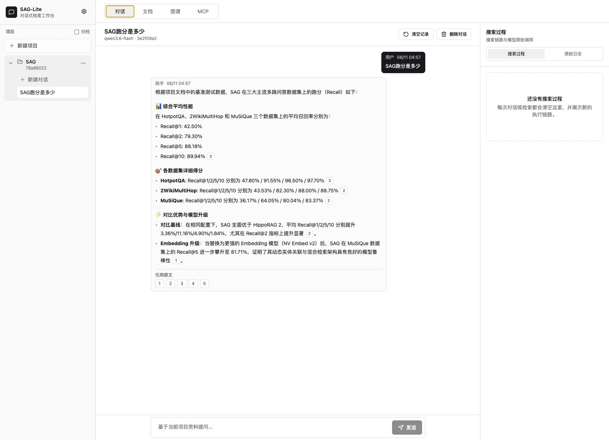
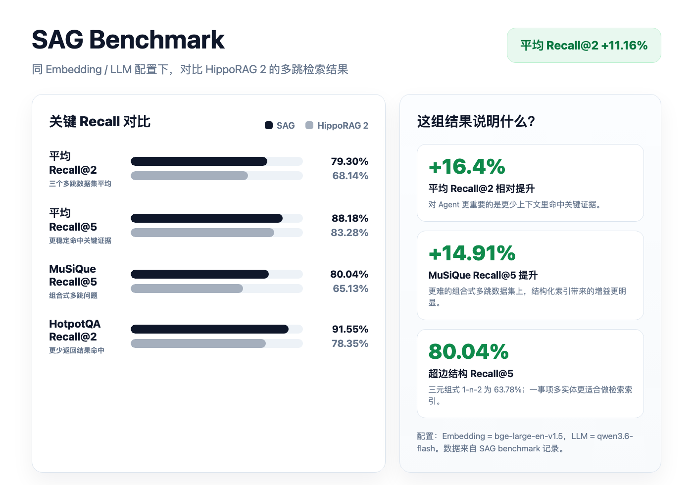
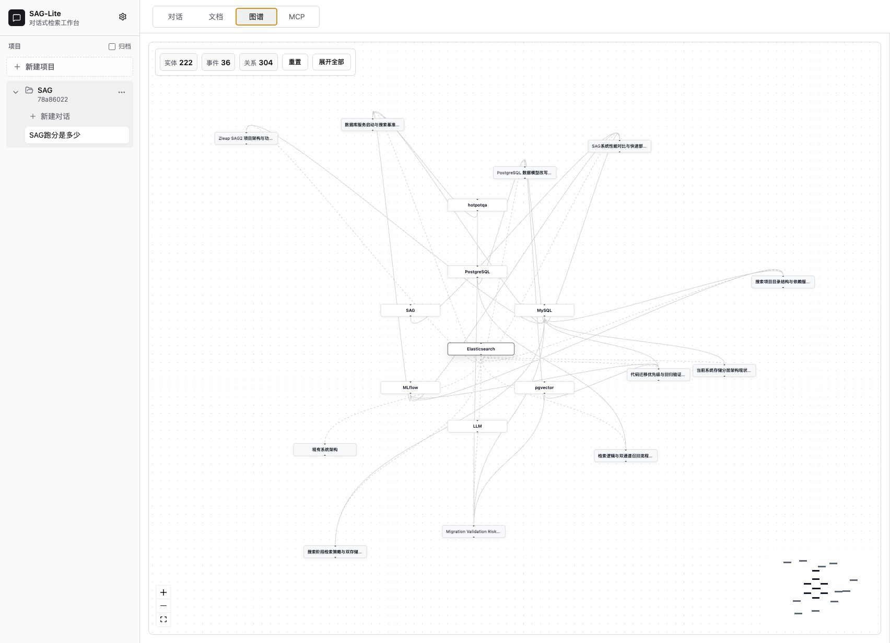

<p align="center">
  
</p>

# SAG

**Language**: [简体中文](README.md) | English

This project is an out-of-the-box document retrieval workbench built on SAG. After you upload Markdown or TXT documents, SAG automatically handles chunking, vectorization, event extraction, entity extraction, and relation organization. You can ask questions over project documents in a ChatGPT-like interface, inspect chunks, events, entities, embeddings, search traces, raw model logs, and explore the knowledge graph.



## A New SOTA for RAG

SAG benchmark reproduction code: [Zleap-AI/SAG-Benchmark](https://github.com/Zleap-AI/SAG-Benchmark)

SAG is a next-generation RAG approach designed for agents. It does not try to simply stuff more chunks into the model. Instead, it redesigns how document knowledge enters the retrieval system.

Traditional vector RAG knows whether two pieces of text are semantically similar, but it does not know who is related to whom or what happened between them. GraphRAG recognizes the value of structure, but many implementations rely on triple extraction, entity merging, community detection, and global graph ranking, which can be costly to build and maintain.

SAG uses a lighter structure that is easier to operate in production:

```text
chunk -> event
chunk -> entities
event <-> entities
```

Each chunk extracts one complete event and multiple entities from the original text. The event preserves the full semantic unit, while entities build the index and enable relational expansion. This is a one-event-to-many-entities hyperedge structure, instead of a large set of fragile `subject -> predicate -> object` triples.


Core advantages of SAG:

- **Better for multi-hop questions**: retrieval can start from a matched event and expand to related events through entity relations.
- **Not a heavyweight knowledge graph**: no global PageRank dependency and no need to rebuild the whole graph for every incremental update.
- **Production ready at scale**: events, entities, relations, and vectors are stored in PostgreSQL / pgvector, with stable multi-hop retrieval implemented in SQL.
- **Agent friendly**: fewer candidates can hit key evidence earlier, reducing downstream LLM reading cost.
- **Traceable**: final answers still point back to original chunks, making evidence easy to verify.

## Benchmark

Under the same configuration:

```text
Embedding = bge-large-en-v1.5
LLM = qwen3.6-flash
Datasets = HotpotQA / 2WikiMultiHop / MuSiQue
```

Compared with HippoRAG 2, SAG achieves clear recall improvements on multi-hop QA. The key result is that **average Recall@2 improves from 68.14% to 79.30%, a gain of 11.16 percentage points, or about 16.4% relative improvement**.



Why does Recall@2 matter? Agents should not have to read a huge pile of context on every step. Finding key evidence earlier with fewer results means lower token cost, lower latency, less distraction, and fewer compounding errors in multi-turn tasks.

Other key results:

- MuSiQue Recall@5: SAG 80.04%, HippoRAG 2 65.13%, a gain of 14.91 percentage points.
- After switching SAG to NV-Embed-v2, MuSiQue Recall@5 further improves to 81.71%, showing that the gain mainly comes from the structure, not merely from a stronger embedding model.
- A triple-style 1-n-2 structure reaches 63.78% Recall@5 on MuSiQue, while SAG's one-event-to-many-entities hyperedge structure reaches 80.04%.

## What SAG Can Do

This project turns SAG into a local workbench that can run immediately. It is suitable for:

- Project document Q&A
- Personal knowledge base search
- RAG / agent prototype validation
- Document event and entity analysis
- MCP tool integration testing
- Search pipeline debugging and model-call inspection

Core features:

- **Project management**: each project has its own documents, conversations, graph, and MCP configuration.
- **Multi-document upload**: upload multiple Markdown / TXT files at once, with processing stages and progress.
- **Document processing results**: inspect chunks, events, entities, embedding data, keyword title search, and paginated browsing.
- **Conversational retrieval**: ask multi-turn questions over the current project, with streaming output and stop generation.
- **Source citations**: answers can show numbered citations; click a number to view the original chunk.
- **Search trace visualization**: the right panel shows SAG's internal retrieval steps and latency in real time.
- **Raw logs**: browser cache stores raw LLM / Embedding / Rerank requests and responses.
- **Knowledge graph**: explore project relations with event and entity nodes; drag, zoom, expand, and open details.
- **MCP integration**: each project exposes its own MCP configuration so external agents can call the current project directly.

## Tech Stack

SAG uses TypeScript across the stack. The frontend is a React + Vite + Tailwind CSS WebUI. The backend uses Fastify HTTP APIs, the MCP TypeScript SDK, and layered service modules. The data layer uses PostgreSQL, pgvector, full-text search, and SQL multi-hop queries. Model providers are OpenAI-compatible LLM, Embedding, and Rerank APIs.

## Workbench Preview

### Document Processing

In the Document tab, you can upload documents, inspect processing status, chunks, events, entities, and embeddings.


### Graph Exploration

In the Graph tab, you can explore entity-event relations across a project. Nodes support drag, zoom, click-to-expand, and double-click details.



### Conversational Retrieval

In the Chat tab, you can ask continuous questions over the current project. Each retrieval refreshes the right-side trace panel for debugging the current call chain.

## Search Modes

SAG provides two modes:

- **Fast mode**: directly matches the query against the entity store using full-text / BM25 search, expands through SAG multi-hop retrieval, and finally uses `qwen3-rerank` to select top-k. This mode does not use an LLM to extract query entities or filter candidates, so it is much faster.
- **Standard mode**: uses an LLM to extract query entities, then runs SAG multi-route recall and LLM reranking. This is useful when you want to compare the higher-precision pipeline.

Both modes are more than ordinary vector search because both use SAG's event/entity index and SQL multi-hop expansion.

## Quick Start

### 1. Prepare the Environment

You need:

- Node.js 20 or later
- npm
- PostgreSQL
- pgvector

If you want the fastest setup, use Docker to start PostgreSQL.

### 2. Clone the Project

```bash
git clone https://github.com/Zleap-AI/SAG.git
cd SAG
```

### 3. Create the Config File

```bash
cp .env.example .env
```

`.env.example` already contains default values. For real usage, fill in your own LLM and Embedding API keys.

### 4. Start PostgreSQL

Using Docker:

```bash
docker compose up -d
```

If you do not want to use Docker, you can use Homebrew on macOS:

```bash
brew install postgresql@17 pgvector
brew services start postgresql@17

/opt/homebrew/opt/postgresql@17/bin/createdb sag_lite
/opt/homebrew/opt/postgresql@17/bin/psql -d sag_lite -c 'create extension if not exists vector;'
```

If you use a local PostgreSQL instance, update `DATABASE_URL` in `.env`, for example:

```env
DATABASE_URL=postgres://your_user@localhost:5432/sag_lite
```

### 5. Install Dependencies and Initialize the Database

```bash
npm install
npm run db:setup
```

### 6. Start the Development Server

```bash
npm run dev
```

Default development URLs:

```text
WebUI: http://localhost:5173
API:   http://localhost:4173
```

### 7. Build and Start Production

```bash
npm run build
npm start
```

Default production URL:

```text
http://localhost:4173
```

## First Use

1. Open the WebUI.
2. Click "New Project" at the top of the left project list.
3. Go to the Document tab and click "Add Document".
4. Upload `.md` or `.txt` files.
5. Wait for the processing queue to finish.
6. Inspect chunks, events, entities, and embedding status.
7. Return to the Chat tab and ask questions over the current project.
8. For debugging, inspect the right-side Search Trace and Raw Logs.
9. For relationship exploration, open the Graph tab.
10. For external agents, open the MCP tab and copy the current project's configuration.

## Configure LLM and Embedding

SAG supports OpenAI-compatible APIs. Default example:

```env
EMBEDDING_BASE_URL=https://api.302ai.cn/v1
EMBEDDING_MODEL=text-embedding-3-large
EMBEDDING_DIMENSIONS=1024

LLM_BASE_URL=https://api.302ai.cn/v1
LLM_MODEL=qwen3.6-flash

RERANK_MODEL=qwen3-rerank
DEFAULT_SEARCH_MODE=fast
```

You can configure models in two ways:

### Option 1: WebUI Global Settings

Click the settings icon at the top of the left sidebar, open Global Settings, and fill in provider, model names, and API keys.

API keys only show as "Configured / Not configured". Plaintext keys are not echoed in the UI or API responses.

### Option 2: `.env`

```env
EMBEDDING_API_KEY=your_embedding_key
LLM_API_KEY=your_llm_key
```

If no API key is configured, the system uses a local deterministic fallback. This is useful for tests and UI inspection, but real retrieval quality requires remote models.

## MCP Integration

SAG can act as an MCP Server for external agents. Each project's MCP configuration binds the current project ID, so tool calls do not need to pass `projectId`.

Open the MCP tab in the WebUI to see the auto-generated `mcpServers` JSON for the current project. It looks like this:

```json
{
  "mcpServers": {
    "sag": {
      "command": "npm",
      "args": ["run", "mcp"],
      "env": {
        "SAG_MCP_SOURCE_ID": "current_project_id"
      }
    }
  }
}
```

Available MCP tools:

- `sag_ingest_document`: import a document and run chunking, event extraction, entity extraction, and vectorization.
- `sag_search`: run SAG multi-route retrieval on the current project and return the internal trace.
- `sag_explain_search`: return the current project's retrieval pipeline explanation and trace.
- `sag_get_event`: query event details by event ID.

## HTTP API Examples

Health check:

```bash
curl http://localhost:4173/health
```

Create a project:

```bash
curl -X POST http://localhost:4173/api/projects \
  -H 'Content-Type: application/json' \
  -d '{"name":"Demo Project"}'
```

Ingest a document:

```bash
curl -X POST http://localhost:4173/ingest \
  -H 'Content-Type: application/json' \
  -d '{"sourceId":"project_id","title":"Demo","content":"# Demo\n\nSAG can search project documents.","extract":true}'
```

Run search:

```bash
curl -X POST http://localhost:4173/api/search \
  -H 'Content-Type: application/json' \
  -d '{"query":"Why is SAG suitable for multi-hop retrieval?","sourceIds":["project_id"],"strategy":"multi","searchMode":"fast","topK":5,"returnTrace":true}'
```

Stream search trace:

```bash
curl -N -X POST http://localhost:4173/api/search/stream \
  -H 'Content-Type: application/json' \
  -d '{"query":"Explain SAG event/entity indexing","sourceIds":["project_id"],"strategy":"multi","returnTrace":true}'
```

## Common Commands

```bash
# Type check
npm run typecheck

# Run tests
npm test

# Build production assets
npm run build

# Start production server
npm start

# Start MCP stdio server
npm run mcp
```

## Project Structure

```text
src/
  ai/                 LLM, Embedding, and Rerank clients
  api/                HTTP API
  config/             Environment configuration
  db/                 Database connection, migrations, repositories, vector tools
  ingestion/          Document chunking and event extraction
  mcp/                MCP Server
  observability/      Logs and model-call records
  services/           Document processing, search, graph, and WebUI services

web/
  src/                React WebUI

migrations/           PostgreSQL schema
test/                 Unit tests
docs/assets/          README screenshots and diagrams
```

## FAQ

### PostgreSQL Connection Failed

First confirm that the database is running:

```bash
docker compose ps
```

Then confirm that `DATABASE_URL` in `.env` is correct.

### pgvector Is Missing

Make sure pgvector is installed and run:

```sql
create extension if not exists vector;
```

If you use `docker compose up -d`, the image already includes pgvector.

### Why Do I Not See Real Model Quality?

If `LLM_API_KEY` and `EMBEDDING_API_KEY` are not configured, the system enters local fallback mode. This is useful for testing, but it is not suitable for judging real retrieval quality.

### Document Processing Is Slow

Document processing calls Embedding and LLM APIs. Speed mainly depends on document count, chunk count, model API latency, and concurrency settings. You can tune this in `.env`:

```env
INGEST_CONCURRENCY=5
```

### The Port Is Already in Use

In development mode, update `.env`:

```env
HTTP_PORT=4173
```

The Vite WebUI uses `5173` by default. If the port is occupied, Vite will show the new address automatically.

## License

MIT License. See [LICENSE](LICENSE).
